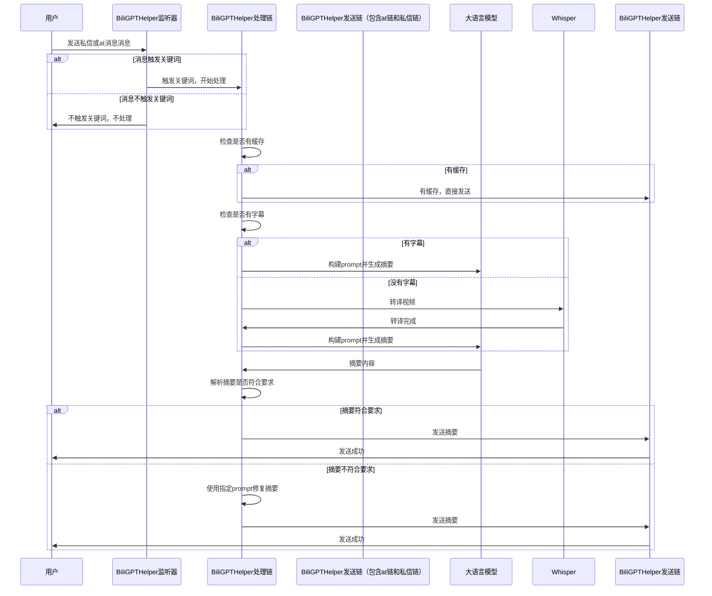

<h2 align="center">✨Bili GPT Helper✨</h2>
<h5 align="center">基于LLM的B站人形自走bot</h5>

### 🌟 介绍

最初的idea来源于b站上不断涌现的AI总结机器人，但效果都不太好，还不是开源，那干脆就自己做一个！

于是，这个项目就诞生了。首先叠个甲，我的码力肯定是不如那些大佬的，so...有什么bug还请见谅

### 📜 声明

当你查阅、下载了本项目源代码或二进制程序，即代表你接受了以下条款

本项目和项目成果仅供技术，学术交流和Python3性能测试使用

本项目贡献者编写该项目旨在学习Python3 ，提高编程水平

用户在使用本项目和项目成果前，请用户了解并遵守当地法律法规，如果本项目及项目成果使用过程中存在违反当地法律法规的行为，请勿使用该项目及项目成果

法律后果及使用后果由使用者承担

开发者（yanyao2333）不会将任何用户的cookie、个人信息收集上传至除b站官方的其他平台或服务器。同时，开发者（yanyao2333）不对任何插件造成的后果负责（包括但不限于账号封禁等后果），如有顾虑，请谨慎使用

若用户不同意上述条款任意一条，请勿使用本项目和项目成果

### 😎 特性

- [x] 使用大模型生成总结
- [x] 优化prompt，达到更好的效果、更高的信息密度，尽量不再说废话。还可以让LLM输出自己的思考、评分，让摘要更有意思
- [x] 支持llm返回消息格式不对自动修复
- [x] 支持艾特和私信两种触发方式
- [x] 支持视频缓存，避免重复生成
- [x] 支持使用whisper自动语音转文字没有字幕的视频，并支持llm后处理whisper转译的内容
- [x] 支持设置最大token限制，避免超额消费（因为无法预测一次请求需要多少token，所以实际使用会超过限额，但在下一次使用时会及时停止）
- [x] 可自动检测和刷新b站cookie（实验性功能）
- [x] 支持自定义触发关键词
- [x] 支持保存当前处理进度，下次启动时恢复
- [x] 支持更详细的视频运行记录
- [x] 支持一键生成并不精美的运行报告，包含一些图表

### 🚀 使用方法

#### 一、通过docker运行

```shell
docker pull yanyaobbb/bilibili_gpt_helper:latest
```

```shell
docker run -d \
    --name biligpthelper \
    -v 你本地的biligpt配置文件目录:/data \
    yanyaobbb/bilibili_gpt_helper:latest
```

首次运行会创建模板文件，编辑config.yml，然后重启容器即可

#### 二、源代码运行

1. 克隆并安装依赖

```shell
git clone https://github.com/yanyao2333/BiliGPTHelper.git
cd BiliGPTHelper
pip install -r requirements.txt
```

2. 编辑config.yml

3. 运行，等待初始化完成

```shell
python main.py
```

4. 试着拿别的号at or 发私信给他“总结一下”，看看效果吧

### ❓ 一些说明

很奇怪，我的帐号不知道为什么收不到任何at我的消息，所有at我的消息都会被shadow
ban，申诉后即使提示恢复但也没有显示。所以我没办法测试at的效果，应该是能用的。有啥问题给我提issue吧

### 💸 这玩意烧钱吗

根据我的测试，单纯使用**gpt-3.5-turbo-16k**，20元大概能撑起5000次时长为10min左右的视频总结（在不包括格式不对重试的情况下）

但在我的测试中，gpt3.5返回的内容已经十分稳定，我并没有遇到过格式不对的情况，所以这个价格应该是可以接受的

如果你出现了格式不对的情况，可以附带bad case示例**发issue**，我尝试优化下prompt

### 🤔 目前问题

1. 目前无法回复楼中楼评论的at
2. whisper速度很慢（使用base模型转译10min视频耗时2min...）
3. 不支持多p视频的总结
4. 你b严格的审查机制导致私信/回复消息触碰敏感词会被屏蔽

### 📝 TODO

- [ ] 完成多个llm的支持，通过配置文件轻松切换
- [ ] 支持whisper-jax，更快速
- [ ] 完善测试用例
- [ ] 支持多账号负载均衡

### ❤ 感谢

[Nemo2011/bilibili-api](https://github.com/Nemo2011/bilibili-api/) | 封装b站api库

### 📚 大致流程

